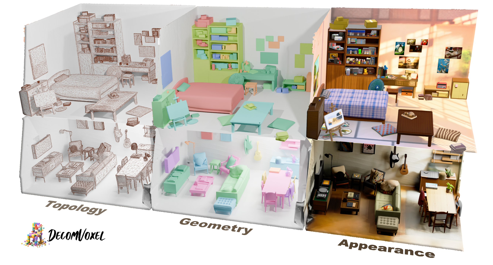

<h2 align="center">
  <b>DecomVoxel: Harnessing 3D-Native Priors with Guided In-situ Denoising Optimization for Decompositional Scene Reconstruction</b>
  <br>
  <small><b><i>SIGGRAPH Asia 2026 - Journal Track (TOG)</i></b></small>
</h2>

<p align="center">
  <a href="https://dali-jack.github.io/Junfeng-Ni/">Junfeng Ni</a><sup>1,2,*</sup>,
  <a href="https://github.com/zr-zhou0o0">Zirui Zhou</a><sup>1,2,*</sup>,
  <a href="https://yixchen.github.io/">Yixin Chen</a><sup>2,†,✉</sup>,
  <a href="https://yuliu-ly.github.io/">Yu Liu</a><sup>1,2</sup>,
  <a href="https://jnnan.github.io/">Nan Jiang</a><sup>3</sup>,
  <br>
  <a href="https://github.com/isxiaohe/">Zhifei Yang</a><sup>3</sup>,
  <a href="https://zhusongchun.net/">Song-Chun Zhu</a><sup>1,2,3</sup>,
  <a href="https://siyuanhuang.com/">Siyuan Huang</a><sup>2,✉</sup>
  <br>
  <sup>*</sup> Equal contribution &nbsp;
  <sup>†</sup> Project lead &nbsp;
  <sup>✉</sup> Corresponding author
  <br>
  <sup>1</sup> Tsinghua University &nbsp;
  <sup>2</sup> State Key Laboratory of General Artificial Intelligence, BIGAI &nbsp;
  <sup>3</sup> Peking University
</p>

<p align="center">
  <a href="https://arxiv.org/abs/2610.01914">
    
  </a>
  <a href="https://decomvoxel.github.io/DecomVoxel-Webpage/">
    
  </a>
  <a href="https://huggingface.co/datasets/JunfengNi/DecomVoxel">
    
  </a>
</p>

<p align="center">
  
</p>

## ✨ Highlights

- Guided in-situ denoising optimization for decompositional scene reconstruction
- Strong 3D-native prior integration with layout preservation
- Generates high-quality textured meshes with clean topology, geometry, appearance, and background.

<!-- ## 📦 Repository Structure

```text
configs/                  # Pipeline and experiment configs
decomvoxel/               # Core code (pipeline, utils, model adapters)
evaluation/               # Evaluation scripts
scripts/                  # Batch run / utility shell scripts
train_demo.py             # Main entry for demo/full pipeline
run_replica_demo.sh       # Quick demo launcher
setup.sh                  # Dependency setup reference script
env.sh                    # Runtime env + key variables
``` -->

## 🛠️ Installation

#### 1. Create environment

```bash
git clone https://github.com/DecomVoxel/DecomVoxel.git
cd DecomVoxel
conda create -n decomvoxel python=3.10 -y
conda activate decomvoxel
```

#### 2. Install dependencies

```bash
bash setup.sh
```

#### 3. Download Models

1. `TRELLIS`

TRELLIS models can be loaded directly by repository name in code. Please follow the [official instructions](https://github.com/microsoft/TRELLIS)

2. `PixelHacker`

Follow the [official instructions](https://github.com/hustvl/PixelHacker) download the weights and place them in:

- decomvoxel/representation/GeoSVR/bg_inpaint/PixelHacker/weight
- decomvoxel/representation/GeoSVR/bg_inpaint/PixelHacker/vae

3. `See3D`

Follow the [official instructions](https://github.com/baaivision/See3D) download the weights and place them in:

- decomvoxel/representation/GeoSVR/bg_inpaint/See3D/MVD_weights

4. `SAM`

Download the SAM checkpoint from the [official repository](https://github.com/facebookresearch/segment-anything#model-checkpoints) and place it at: decomvoxel/representation/GeoSVR/bg_inpaint/checkpoint/segment-anything/sam_vit_h_4b8939.pth


#### 4. Load runtime environment

```bash
source env.sh
```

Set your keys in `env.sh` (or export them in shell):

- `ARK_API_KEY` for Seedream
- `ATLASCLOUD_API_KEY` for NanoBanana and GPTImage2

Conditioning image generation defaults to `Seedream`.

## 🗂️ Dataset

- Download links: [Data](https://huggingface.co/datasets/JunfengNi/DecomVoxel)

> **Quick test:** The Hugging Face repository provides the Replica `scan1` scene as a standalone download to help you get started quickly.

Expected layout:

```text
datasets/
  Replica/
    (GTmesh)
    scan1/
      images/
      instance_masks/
      sparse/
      location_modify.json
      scene_graph.json
      object_categories.json        # optional but recommended
      idx_to_instance_id.json       # optional
    scan2/
      ...
  Scannetpp/
    ...
  Demo/
    ...
```

## 🚀 Quick Start

### Replica demo

```bash
source env.sh
bash run_replica_demo.sh
```

Default output path:

```text
outputs/demo_replica/scan1
```

### Switch condition image model

DecomVoxel supports three built-in conditioning-image backends:

- `Seedream` (recommended)
- `GPTImage2`
- `NanoBanana`

You can specify image model through argument `img_model`, or set it in the YAML config:

```yaml
img_model: NanoBanana
```

You can also pass model-specific parameters with top-level `img_model_params` in YAML:

```yaml
img_model: GPTImage2
img_model_params:
  output_format: jpeg
  quality: medium
  size: 1024x1024
  moderation: low
```

Or pass them from CLI with JSON:

```bash
python train_demo.py \
  --mode full_pipeline \
  --source_path datasets/Replica/scan1 \
  --model_path outputs/demo_replica/scan1 \
  --img_model GPTImage2 \
  --img_model_params_json '{"output_format":"png","quality":"high","size":"1536x1024"}'
```

Currently supported model-specific parameters:

- `NanoBanana`: `aspect_ratio`, `resolution`, `thinking_level`, `enable_web_search`, `enable_base64_output`, `enable_sync_mode`
- `GPTImage2`: `output_format`, `quality`, `size`, `moderation`, `enable_base64_output`, `enable_sync_mode`

#### Customized Model

Built-in adapter files:

- `decomvoxel/model/Seedream/call_seedream.py`
- `decomvoxel/model/NanoBanana/call_nanobanana.py`
- `decomvoxel/model/GPTImage2/call_gpt_image_2.py`

1. Write a new adapter file.
2. Register the model name in `decomvoxel/pipeline/cond_image_generate.py`:
  - extend `_normalize_img_model`
  - extend `_get_image_model_caller`
3. If your backend needs custom knobs, add them to the adapter function signature and pass them through `img_model_params`.
4. Then select it with `--img_model <YourModelName>` or `img_model: <YourModelName>` in the config.


### Background inpainting demo

```bash
GPU=2 bash bg_inpaint_replica.sh
```

Default output path:
```text
outputs/bg/scan1/see3d_guidance_views/bg_training/mesh/tsdf/tsdf_fusion_post.ply
```


Main stages:

1. GeoSVR stage
2. 3D segmentation
3. Conditioning image generation
4. Scene geometry SDS
5. Scene appearance SDS
6. Mesh export + scene merge
7. Background optimization


## 🧪 Evaluation

1. Put the mesh to be evaluated under the exps/ directory (for example, exps/Replica/scan1/scene_combined.glb).
2. Set the configuration options in scripts/eval_replica_geo.sh and scripts/eval_replica_render.sh.
3. Run:
   ```bash
   # Geometry Evaluation
    bash scripts/eval_replica_geo.sh
   # Appearance Evaluation
    bash scripts/eval_replica_render.sh
   ```


## 🔧 Configuration

Primary configs are under:

```text
configs/
```

Common tunables:
- mask_weight
- cfg_strength
- print_interval / save_interval
- prune_interval / prune_strength


## 📚 Citation

```bibtex
@article{ni2026decomvoxel,
  title = {DecomVoxel: Harnessing 3D-Native Priors with Guided In-situ Denoising Optimization for Decompositional Scene Reconstruction},
  author = {Ni, Junfeng and Zhou, Zirui and Chen, Yixin and Liu, Yu and Jiang, Nan and Yang, Zhifei and Zhu, Song-Chun and Huang, Siyuan},
  journal = {ACM Transactions on Graphics},
  year = {2026}
}
```

## 🙏 Acknowledgements

This project explicitly builds upon and sincerely thanks the following open-source projects:

- [TRELLIS](https://github.com/microsoft/TRELLIS)
- [GeoSVR](https://github.com/Fictionarry/GeoSVR)
- [FreeArt3D](https://github.com/CzzzzH/FreeArt3D)
- [SimRecon](https://github.com/xiac20/SimRecon)

We also thank the broader open-source communities of neural rendering, 3D generation, and scene reconstruction.
